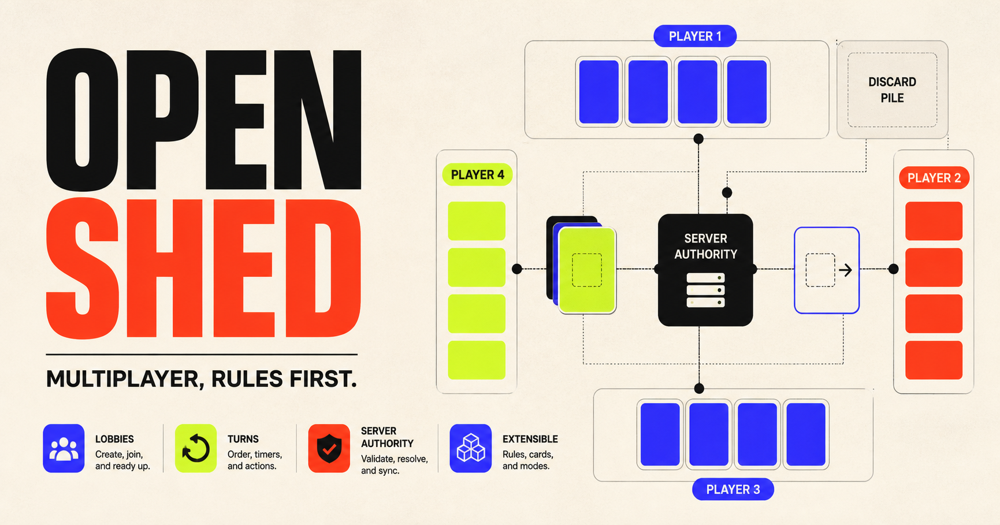

# Open Shed

[](https://github.com/NiyiOke/open-shed-card-engine/actions/workflows/ci.yml)
[](LICENSE)

Open Shed is an original, extensible multiplayer shedding-card game engine and responsive web client. The first rules profile implements the complete gameplay described by Mattel's *UNO Show 'Em No Mercy* instruction sheet, while keeping the code, visual system, and card presentation independently authored.

- **Current release:** V1.6.3
- **Play:** [open-shed-card-game.neo-dabuda.chatgpt.site](https://open-shed-card-game.neo-dabuda.chatgpt.site/)
- **Build with us:** [view the source](https://github.com/NiyiOke/open-shed-card-engine), [open an issue](https://github.com/NiyiOke/open-shed-card-engine/issues), or read the [contribution guide](CONTRIBUTING.md).



The project deliberately starts with the difficult foundation: server-authoritative rules, private hands, durable lobbies, cryptographically randomized production shuffles, reconnect-safe turns, and strict state projection. Communication and realtime refresh are separate from the rules engine so a transport or chat failure cannot decide a move or expose another player's state.

## What works

- 2–6 player online lobbies with private invitation URLs and shareable six-character codes
- Opt-in open-table discovery, privacy-preserving public aliases, lobby presence, direct invitations, and durable blocking
- ChatGPT sign-in on hosted Sites deployments and isolated local test identities in development
- Public-table quick phrases and reactions, invite-only free-text chat, reporting, mute/block controls, and 24-hour message expiry
- A versioned 168-card physical deck manifest with unique card instances
- Match-by-color, number, or symbol and mandatory draw-until-playable flow
- Equal-or-higher draw stacking for +2, colored +4, reverse +4, +6, and +10
- Mercy knockout at 25 cards, including the eliminated-card reshuffle reserve
- Mandatory 0 hand rotation and 7 hand swap
- Skip, Reverse, Discard All, Skip Everyone, Wild Reverse Draw 4, Wild Draw 6, Wild Draw 10, and Wild Color Roulette
- Server-ordered UNO declaration and catch windows
- Empty-hand and last-player-standing victories
- One accessible rules registry shared by the signed-out rulebook and the in-game guide
- Viewer-specific state: your hand and forced drawn card are returned only to you; opponent hands and draw order never leave the server
- Atomic optimistic writes, durable actor-scoped command receipts, append-only public events, bounded mutation quotas, expiry cleanup, and D1 persistence
- Responsive keyboard/touch UI, durable game deep links, a live public event feed, and deterministic `render_game_to_text` / `advanceTime` test hooks
- Reconnect-safe presence, contextual turn guidance, server-verified host recovery, same-table rematches, round-win history, and series continuity
- Content-free WebSocket invalidations for faster game and chat refresh, with authoritative refetches and permanent polling fallback

Deployment switches keep open-table discovery, opt-in player presence, realtime hints, and optional voice services independently controllable. Their presence in the source does not require a self-hosted deployment to enable them.

## Architecture

```text
Browser clients
  ├─ HTTPS commands, chat, presence, and authorized reads
  │    └─ Vinext / Cloudflare Worker API
  │         ├─ trusted Sites identity headers
  │         ├─ pure versioned rules reducer
  │         ├─ per-viewer state and chat projection
  │         └─ D1 authoritative storage
  └─ optional WebSocket connection
       └─ hibernating Durable Object companion
            └─ content-free game/chat invalidation hints only

Every invalidation triggers a fresh authorized HTTPS read.
Adaptive polling remains active as the recovery path.
```

Game commands, chat messages, reports, moderation actions, membership, presence, and every rules decision remain authoritative HTTPS and D1 operations. The separate realtime companion cannot read or mutate game data; it sends only content-free `game` or `chat` invalidation hints, after which the client refetches its authorized projection. If the socket is disabled or unavailable, the client returns to its normal polling cadence.

The domain engine in `lib/game/` imports no React, Vinext, Cloudflare, or database code. Transport and storage can evolve without rewriting game rules.

More detail is in [docs/architecture.md](docs/architecture.md). The V1.6.3 transport contract is documented in [docs/v1.6.3-realtime-updates.md](docs/v1.6.3-realtime-updates.md), and ambiguous paper-rule decisions are pinned in [docs/rules-decisions.md](docs/rules-decisions.md) so running games remain replayable as the project evolves.

## Local development

Requirements:

- Node.js 22.13 or newer (22.14 is pinned in `.nvmrc`)
- npm

```bash
nvm use
npm ci
npm run dev
```

Open `http://localhost:3000`. Local development uses project-local D1 state and a safe local test identity. Use **Switch test player** to simulate another browser participant.

Useful checks:

```bash
npm run test:unit
npm run typecheck
npm run lint
npm run build
npm run test:v11-browser
npm test
```

Schema changes:

```bash
npm run db:generate
```

Inspect every generated SQL migration before committing it. Sites applies committed migrations to the hosted D1 database.

## Self-hosting boundary

The production configuration targets ChatGPT Sites and Cloudflare D1. Sites supplies trusted identity headers at the ingress boundary; a generic deployment must replace that adapter with verified sessions or tokens and must never expose the local test-identity path in production. Self-hosters are also responsible for provisioning storage, applying the committed migrations, setting exact origins and feature switches, and protecting production secrets.

Realtime is optional and requires the separate Cloudflare Worker under [`realtime-worker/`](realtime-worker/), a shared secret configured outside source, and the exact deployed app origin. The main app continues to work through HTTPS and polling without that companion. See the [architecture guide](docs/architecture.md), [security policy](SECURITY.md), and [realtime deployment guide](realtime-worker/README.md) before exposing a deployment to users.

## API shape

- `GET /api/session` — identity state
- `GET|POST /api/games` — private memberships and table creation
- `POST /api/games/join` — code-based join
- `GET /api/games/:gameId` — current viewer-safe snapshot
- `POST /api/games/:gameId/commands` — typed, versioned game mutation
- `GET|POST /api/games/:gameId/presence` — viewer-safe presence snapshot and authenticated heartbeat
- `GET|POST /api/games/:gameId/messages` — authorized, bounded table-chat pages and sends
- `POST /api/games/:gameId/realtime-ticket` — short-lived, room-bound realtime authorization
- `GET /api/public/rooms` and `POST /api/public/rooms/:listingId/join` — privacy-safe open-table discovery and join
- `GET|PUT /api/lobby-presence` and `POST /api/lobby-presence/heartbeat` — opt-in player lobby and invitation state

Every command supplies a unique `commandId` and `expectedRevision`. Actor identity comes from Sites' trusted server headers, never from the command body. A self-hosted deployment must replace this Sites-specific identity adapter at its ingress boundary.

## Rules provenance

The primary behavior source is Mattel's [English instruction sheet HVW18](https://service.mattel.com/instruction_sheets/HVW18-Eng.pdf). It confirms 168 cards but does not print the per-card inventory. The exact manifest is independently corroborated from physical deck inventories and sums to the official total; that provenance distinction is retained in code comments, tests, and the rules decision record.

This repository contains no Mattel logos, commercial card artwork, manual scans, or copied visual trade dress. UNO and related names are trademarks of Mattel. Open Shed is an unofficial engineering project and is not affiliated with or endorsed by Mattel.

## Contributing

Contributions are welcome across rules tests, accessibility, performance, privacy, documentation, and multiplayer reliability. Start with [CONTRIBUTING.md](CONTRIBUTING.md), look for a [`good first issue`](https://github.com/NiyiOke/open-shed-card-engine/issues?q=is%3Aissue+is%3Aopen+label%3A%22good+first+issue%22), or propose a focused issue before a large change. Pull requests are reviewed by a maintainer and must pass the repository checks before they can be approved and merged.

Rule changes require a versioned profile, deterministic tests, and a migration/replay note when they affect persisted games. Security issues must follow [SECURITY.md](SECURITY.md) instead of being filed publicly.

## License and third-party rights

The original source code, documentation, and project-created visual assets in this repository are licensed under Apache-2.0 unless a file says otherwise. See [LICENSE](LICENSE) and [ASSETS.md](ASSETS.md).

That license does not grant rights to third-party names, trademarks, referenced rules material, or third-party assets. Contributors must have the right to submit every asset they add and should not contribute commercial card artwork, manual scans, logos, or copied trade dress. UNO and related names remain trademarks of Mattel; Open Shed remains unaffiliated with and unendorsed by Mattel.
